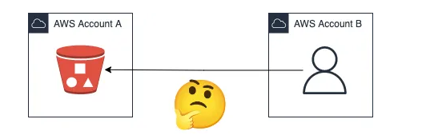
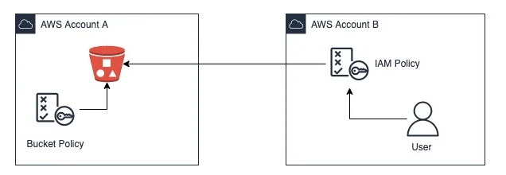
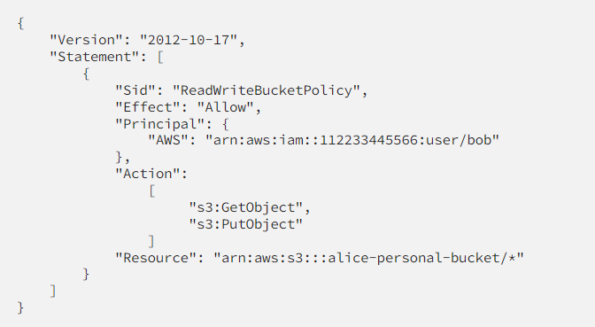
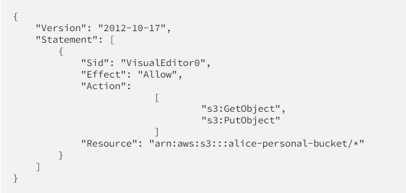
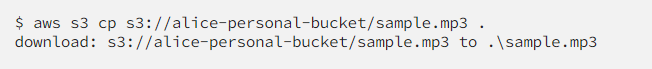
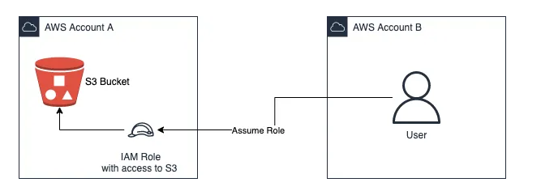
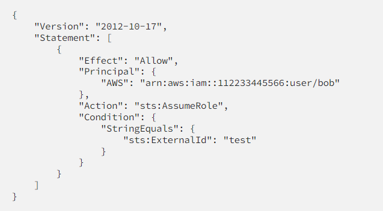
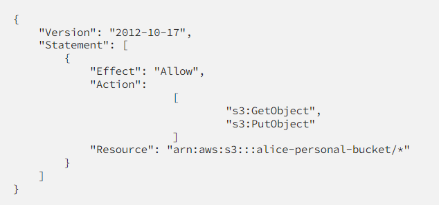

# https://awstip.com/how-to-access-s3-bucket-from-another-aws-account-55f1b0a878ed

How to access S3 bucket from another AWS account

In this article, I will show you how to access S3 bucket from another AWS account.

Let’s start!

Two ways — Using different type of policies
A policy is an object assigned to a resource or identity which allows you to define the permissions it will have. We can distinguish two type of policies:

Identity-based policies. Attached directly to IAM identities (users, groups, roles). This type of policies grant permissions to an identity.
Resource-based policies. Attached to resources. These policies allow you to grant permissions to the principal defined in them.
As you might have guessed, we can use these two types of policies to achieve our goal!

Using resource-based policies
Resource-based policies in AWS are typically JSON documents that are attached to resources and determine the actions that the specified principal can perform.

Let’s imagine we have the following scenario: A user in account B, Bob, wants to read and write to a bucket that Alice has in account A.

Using resource-based policies, Alice must attach a policy that allows such actions and whose principal is Bob. The policy would look like the following:

This policy specifies Bob, in account B, as the principal. Account B is described by its ID 112233445566. Bob can now perform certain actions described in “Action” field: GetObject and PutObject.

However, this is not enough for Bob to access Alice’s bucket cross-account: he needs to have an identity policy created in his AWS Account B that matches the permission that Alice established in her bucket:

As a result, Bob will now be able to access Alice’s bucket from another AWS account!

Easy, isn’t it?

--==================

Using STS Assume Role
Assuming an IAM role is another way to access S3 bucket from another AWS account. I must admit this is my preferred way 😬

An IAM role is an identity with permission policies to determine the actions that such entity can perform. This role, unlike a user, is intended to be assumed by whoever needs it. One of the advantages of AWS roles is that they do not have passwords or access keys associated with them. Instead, they provide temporary security credentials for the session.

Most of the times, users need not only S3 buckets permission, but they also need access to other AWS resources. Using IAM roles you will be able to configure all accesses in a simpler way. Just add the necessary policies to the same role and that’s all! This is why I mentioned it is my preferred way.

In order to achieve the same goal using AWS STS (Simple Token Service) assume role, there are two requirements:

Account A needs to have a role (let’s call it account-a-role). This role should have a trust relationship with Account B which will allow users in this account to perform sts:AssumeRole.
Bob needs permission in Account B to sts:AssumeRole in Account A.
In other words, Alice needs to create a role just like this:

Alice also needs to attach a policy to her role that indicates the permission she wants Bob to have in her bucket:

And Bob needs an IAM policy like the following in his account B:

Where 111111222222 is the Account A ID. This policy will allow Bob to assume Alice's role:

aws sts assume-role --role-arn arn:aws:iam::111111222222:role/account-a-role --role-session-name bob-bucket-access --profile bob

The temporary credentials returned after running the above command needs to be configured in AWS CLI and, after that, Bob is able to access Alice’s bucket!